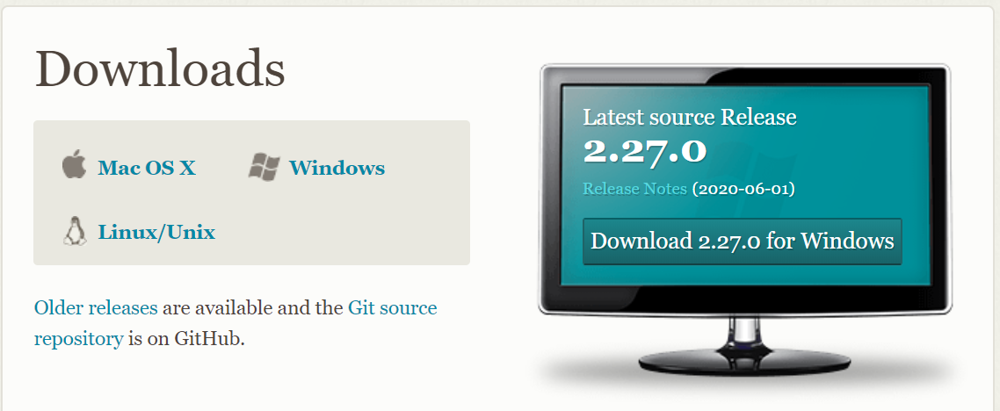
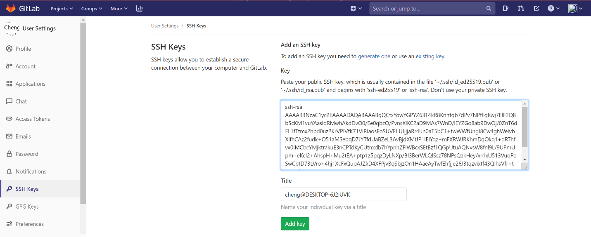
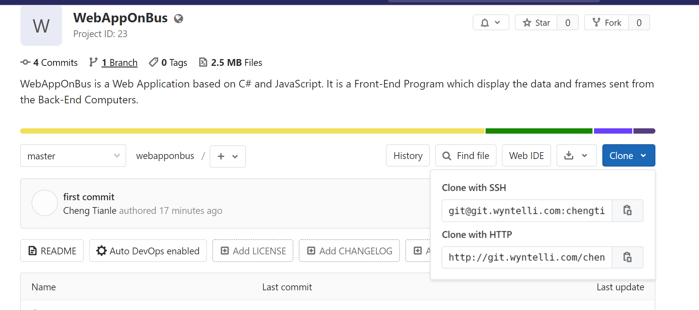
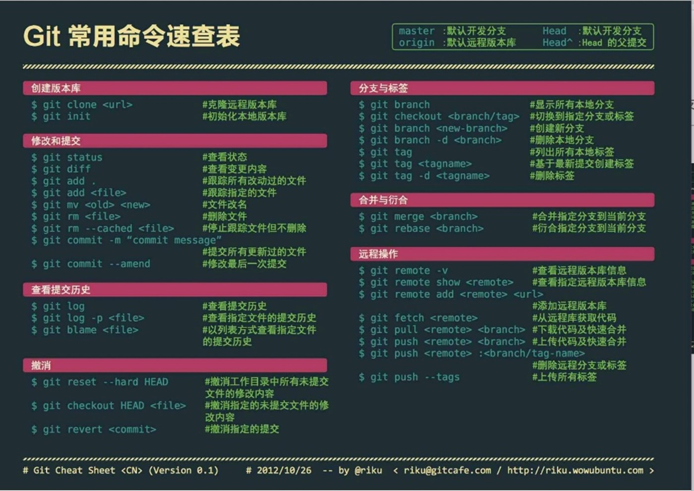

GitLab使用

**0.下载并安装Git**

<https://git-scm.com/downloads>

打开自己的工程文件夹

初次使用时 ssh-keygen 然后一路回车
在Users/\<自己的Windows用户名\>/.ssh中找到id_rsa.pub通过记事本或者Notepad++打开，将其中内容全选复制后，打开GitLab--\>用户头像--\>Settings--\>SSH
Keys 将复制的内容粘贴到Key下方的输入栏中，点击下方的AddKey。

**注意：下述内容需连接公司VPN后进行**

**1.初始化本地仓库**

在自己的项目文件夹中右键，打开Git Bash，输入：git init

**2.添加远程仓库**

在Gitlab上新建项目 New Project 选择Public公开 添加README

打开项目后点蓝色Clone，复制Clone with SSH下的内容

git remote add origin \<git\@ssh\>

e.g : git remote add origin
[git\@git.wyntelli.com:chengtianle/webapponbus.git](git@git.wyntelli.com:chengtianle/webapponbus.git)

**3.添加本地文件**

添加所有文件 git add .

添加单个文件 git add \<文件名带后缀\>

**4.拉取远程仓库内容**

git pull origin master

若遇到冲突并提示“请在合并前提交或贮藏您的修改“

git stash 贮藏修改

git pull origin main 重新拉取

git stash pop 自动合并，如有冲突，需手动解决

合并完成后，git stash drop 删除贮藏内容

**5.添加提交信息**

git commit -m “first commit”

后续提交时，可将first commit改为每次提交的更改内容

**6.上传本地仓库**

git push origin master

注意第一次提交前务必执行步骤4中的pull操作，否则无法push

后续修改代码后，若为调试代码，不要直接push到master（主分支）上，可以新建branch后再push

强制提交

git push -u origin master

**7.新建分支**

git branch \<分支名\>

分支上提交之前同样需要commit操作 git commit -m “\<提交内容\>”

提交操作 git push origin \<分支名\>

**8.查看分支**

查看本地分支 git branch

查看远程分支 git branch -r

查看所有分支 git branch -a

此时前面有\*的分支为当前所在分支

**9.切换分支**

git checkout \<分支名\>

创建并切换分支 git checkout -b \<分支名\>

**10.删除分支**

git brach -d \<分支名\>

**11.合并分支**

git merge \<分支名\>

该操作为将\<分支名\>合并到当前所在分支，一般切换回master分支后再执行此操作，将其他分支合并到master上。

**12.日志查看**

git log

commit 1d38bd32482ea1ec2ceb63c5731351013648f5f8 (HEAD -\> master, origin/master)

Author: chengtianle \<chengtianle1997\@163.com\>

Date: Mon Jun 22 20:42:08 2020 +0800

first commit

恢复到该日志下：

git reset \<日志编码\>

e.g: git reset 1d38bd32482ea1ec2ceb63c5731351013648f5f8

**注：在上传同步代码时，请删除不必要的编译中间文件，例如使用VS时，项目文件夹中产生的
.vs 文件夹（删除该文件夹可能导致项目工程属性内容丢失）**

**13. master分支切main分支（github更新默认分支名为main的处理）**

git checkout -b main

git branch

git merge master

git pull origin main –allow-unrelated-histories

git push origin main

**14. LFS大文件传输**

#### *Linux*

1.  curl -s
    https://packagecloud.io/install/repositories/github/git-lfs/script.deb.sh \|
    sudo bash  
    \`

2.  sudo apt-get install git-lfs

3.  git lfs install

#### *Mac*

1.  安装HomeBrew /usr/bin/ruby -e "\$(curl -fsSL
    https://raw.githubusercontent.com/Homebrew/install/master/install)"

2.  brew install git-lfs

3.  git lfs install

#### *Windows*

1.  下载安装 [windows
    installer](https://link.jianshu.com?t=https%3A%2F%2Fgithub.com%2Fgithub%2Fgit-lfs%2Freleases)

2.  运行 windows installer

3.  在命令行执行 git lfs install

### 使用

1.  执行 git lfs install 开启lfs功能
2.  使用 git lfs track 命令进行大文件追踪 例如git lfs track "\*.png"
    追踪所有后缀为png的文件
3.  使用 git lfs track 查看现有的文件追踪模式
4.  提交代码需要将gitattributes文件提交至仓库. 它保存了文件的追踪记录
5.  提交后运行git lfs ls-files 可以显示当前跟踪的文件列表
6.  将代码 push 到远程仓库后，LFS 跟踪的文件会以『Git LFS』的形式显示:
7.  clone 时 使用'git clone' 或 git lfs clone均可

**15. 其他命令**

